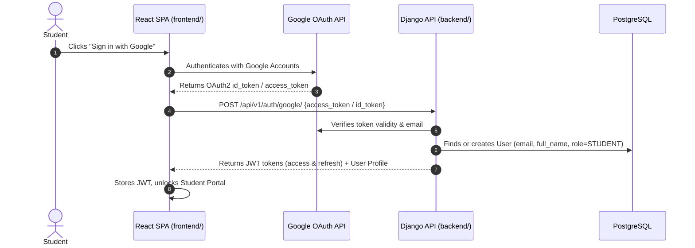
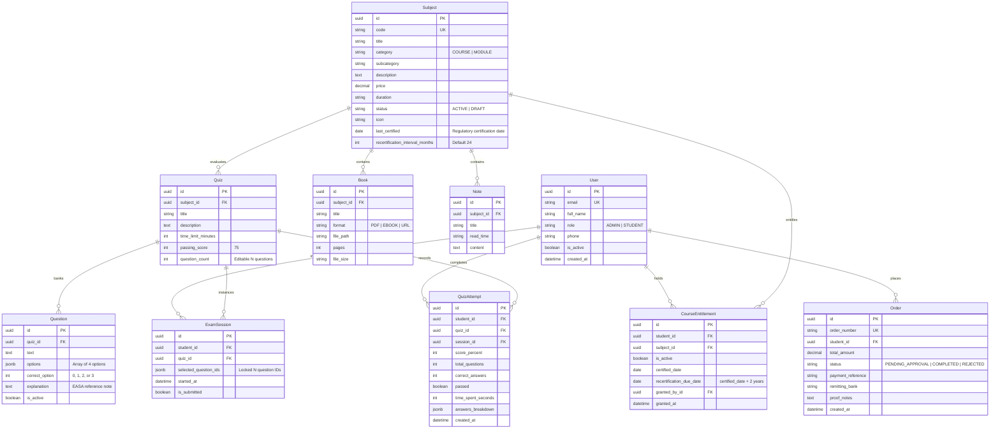

# Backend Architecture Specification & Implementation Plan
## Trinity Aviation Academy — Django REST Framework Backend
**Document Version:** 1.1.0  
**Target Framework:** Python 3.11+ / Django 5.2 / Django REST Framework / Celery / PostgreSQL  
**Base Scaffolding:** `backend/` (Django Scaffold) & `frontend/` (React / Vite)

---

## 1. Executive Summary & Context

The **Trinity Aviation Academy** platform architecture separates into two clear primary directories:
- **`frontend/`**: React 19 + Bootstrap 5 + Vite Single Page Application (SPA), ready for Vercel deployment.
- **`backend/`**: Django 5.2 + Django REST Framework + Celery + PostgreSQL production-grade API service.

This document reflects key requirements and domain rules:
1. **User Types (Strictly 2 Roles):** `ADMIN` and `STUDENT`.
2. **Email-Centric Identity:** Email is the primary unique identifier. No `license_goal` field for now.
3. **Google OAuth 2.0 Integration:** Direct Google Account login and registration via `allauth.socialaccount.providers.google` and `dj_rest_auth`.
4. **Subject Recertification Lifecycle (`last_certified`):** EASA Part-145 statutory recurrent training mandates re-testing every **2 years (24 months)**. Subjects track `last_certified` and enforce candidate recertification schedules.
5. **Configurable Quiz Question Count:** The number of questions served per student test attempt ($N$) is editable dynamically whenever an administrator adds or edits a quiz.

---

## 2. Key Architectural Decisions

### 2.1 Domain-Driven App Decomposition (`backend/project/`)

```
backend/
├── config/                      # Global project settings, WSGI/ASGI, URLs, Nginx, Env
│   ├── settings/                # base.py, dev.py, prod.py, stage.py
│   ├── env/                     # Environment variables (.env)
│   └── urls.py                  # Root API router (/api/v1/...)
└── project/
    ├── core/                    # Abstract base models (UUID, timestamps), pagination, logging
    ├── users/                   # Custom User (email-based, Roles: ADMIN & STUDENT, Google OAuth)
    ├── curriculum/              # Courses, Modules, Books (PDFs), Notes, Recertification Tracking
    ├── assessments/             # Quizzes (dynamic question_count), Question Banks, Exam Sessions
    └── enrollments/             # Orders, Bank Wire Proofs, Entitlements, Admin 3-Column Matrix
```

---

### 2.2 User Model & Role-Based Access Control (RBAC)
- **Roles:** Strictly two types:
  - `ADMIN`: Academy director, registrar, curriculum manager. Has full write permissions, access to telemetry, quiz attempt audits, and the 3-column Grant Access matrix.
  - `STUDENT`: Aviation candidate. Enrolled in subjects, takes randomized quizzes, submits bank transfer wire references, downloads certificates.
- **Fields:**
  - `id`: UUID (Primary Key)
  - `email`: EmailField (unique, required, username substitute)
  - `full_name`: CharField (required for official EASA certificate issuance)
  - `phone`: CharField (optional)
  - `role`: CharField with choices `[('ADMIN', 'Admin'), ('STUDENT', 'Student')]`, default=`STUDENT`.
  - `is_active`: BooleanField
  - `created_at` / `updated_at`: DateTimeField

---

### 2.3 Google OAuth 2.0 Integration


---

### 2.4 EASA 2-Year Recertification Lifecycle (`last_certified`)
Under EASA Part-145.A.30(e) and Part M, safety-critical certifications (Human Factors, Fuel Tank Safety Phase 2, EWIS) require recurrent training **every 24 months (2 years)**.
- **`Subject` Model Fields:**
  - `last_certified`: DateField(null=True, blank=True) — Date when curriculum material was reviewed and re-certified by regulatory auditors.
  - `recertification_interval_months`: PositiveIntegerField(default=24) — Standard 24-month EASA cycle.
- **`StudentCertification` / `CourseEntitlement` Lifecycle:**
  - `certified_date`: DateField(null=True, blank=True) — Recorded when the candidate passes the subject exam with $\ge 75\%$.
  - `recertification_due_date`: DateField — Computed as `certified_date + timedelta(days=730)` (2 years).
  - Status indicator:
    - `CURRENT`: $< 21$ months since certification.
    - `EXPIRING_SOON`: $21–24$ months (warning prompt displayed on student dashboard).
    - `EXPIRED / RECERTIFICATION_DUE`: $> 24$ months (triggers recertification exam requirement).

---

### 2.5 Editable Quiz Question Count & Random Sampling Engine
- Administrators can set and modify `question_count` ($N$) during quiz creation or editing.
- When an assessment is initiated:
  ```python
  # Random sampling algorithm in assessments/services.py
  def start_exam_session(user: User, quiz: Quiz) -> ExamSession:
      question_bank = list(quiz.questions.filter(is_active=True).values_list('id', flat=True))
      sample_size = min(quiz.question_count, len(question_bank))
      
      # Cryptographically secure random selection
      selected_ids = random.sample(question_bank, sample_size)
      
      session = ExamSession.objects.create(
          student=user,
          quiz=quiz,
          selected_question_ids=selected_ids,
          started_at=timezone.now()
      )
      return session
  ```
- **Information Hiding**: The student API response contains question prompts and options `[A, B, C, D]` only. Answer keys and explanations remain sealed until submission.

---

### 2.6 External Bank Wire & 3-Column Grant Access State Machine
Tuition is remitted via direct bank wire:
1. Student views bank account details (IBAN, SWIFT, Account Title, Reference).
2. Student submits transfer reference ID $\rightarrow$ `Order.status = 'PENDING_APPROVAL'`.
3. Admin opens 3-column Grant Access matrix:
   - **Column 1:** Select Subject (Course or Module).
   - **Column 2:** Unenrolled students with pending wire reference highlighted.
   - **Column 3:** Enrolled students with access active.
4. Admin clicks **Grant Access**:
   - `CourseEntitlement` activated atomically.
   - `Order.status` marked `COMPLETED`.
   - Celery async task dispatches enrollment email.

---

## 3. Database Schema Specification



---

## 4. API Endpoints Specification

### 4.1 Authentication & Google OAuth
- `POST /api/v1/auth/login/` — Standard email & password authentication (returns JWT).
- `POST /api/v1/auth/registration/` — Candidate self-registration (assigns `role=STUDENT`).
- `POST /api/v1/auth/google/` — Google OAuth2 token exchange; returns JWT tokens and creates candidate user if first login.
- `GET /api/v1/auth/user/` — Authenticated user profile and permissions.

### 4.2 Curriculum & Recertification
- `GET /api/v1/curriculum/subjects/` — List all Part-66 & Part-145 subjects with `last_certified` and recertification status.
- `POST /api/v1/curriculum/subjects/` — Admin creates subject (sets code, title, price, `last_certified`).
- `PUT /api/v1/curriculum/subjects/{id}/` — Admin updates subject, books, notes, recertification interval.
- `DELETE /api/v1/curriculum/subjects/{id}/` — Admin deletes subject.
- `GET /api/v1/curriculum/subjects/{id}/books/{book_id}/download/` — Signed download URL for verified students.

### 4.3 Assessments & Randomized Question Sampler
- `POST /api/v1/assessments/quizzes/{id}/start-attempt/` — Generates `ExamSession`, samples $N$ questions (`question_count`), conceals answer keys.
- `POST /api/v1/assessments/sessions/{session_id}/submit/` — Server grades choices, checks against 75% EASA threshold, creates `QuizAttempt` audit record, returns detailed breakdown.
- `GET /api/v1/assessments/attempts/` — Audit ledger of all attempts across all students (Admin: all, Student: own).
- `GET /api/v1/assessments/attempts/{id}/` — Granular breakdown modal data (question text, options, candidate selection, correct key, rationale).
- `PUT /api/v1/assessments/quizzes/{id}/` — Admin edits quiz metadata including `question_count`.

### 4.4 Enrollments, Bank Wire & 3-Column Access Matrix
- `POST /api/v1/enrollments/orders/submit-wire/` — Student submits wire reference and proof.
- `GET /api/v1/enrollments/orders/my-orders/` — Student lists purchase orders and simulated certificates.
- `GET /api/v1/enrollments/access-matrix/` — Admin fetches 3-column matrix data for selected subject.
- `POST /api/v1/enrollments/grant-access/` — Admin batch-grants access and reconciles pending orders.
- `POST /api/v1/enrollments/revoke-access/` — Admin revokes entitlement.

---

## 5. Implementation Roadmap (Phased Plan)

| Phase | Milestone | Deliverables |
| :--- | :--- | :--- |
| **Phase 1** | **Backend Setup & App Scaffolding** | Configure `config/settings/base.py`, register `project.users`, `project.curriculum`, `project.assessments`, `project.enrollments`, configure CORS for `http://localhost:3000`. |
| **Phase 2** | **Users & Google OAuth** | Custom User (email, 2 roles: Admin/Student, no license goal), Google OAuth provider integration, JWT token flow. |
| **Phase 3** | **Curriculum & Recertification** | `Subject` model with `last_certified` and 2-year recertification logic, `Book` and `Note` models, management seed script. |
| **Phase 4** | **Assessment Engine** | `Quiz` (editable `question_count`), `Question` bank, random sampling service, 75% EASA grading, attempt audit breakdown. |
| **Phase 5** | **Orders & 3-Column Grant Matrix** | `Order` (bank wire proof), `CourseEntitlement`, 3-column Grant Access matrix endpoint, batch activation. |
| **Phase 6** | **Frontend Integration & Verification** | Connect React Vite SPA in `frontend/` to Django REST endpoints in `backend/`, verify full flows. |
